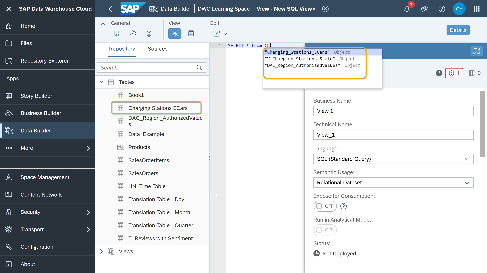
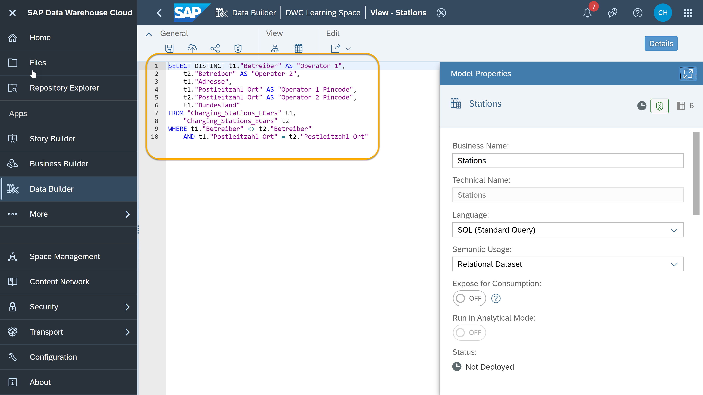
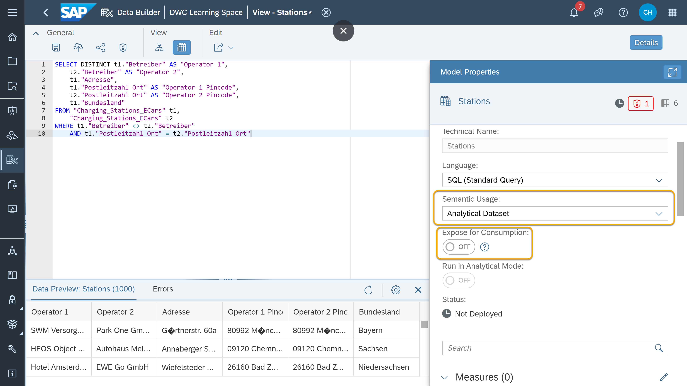
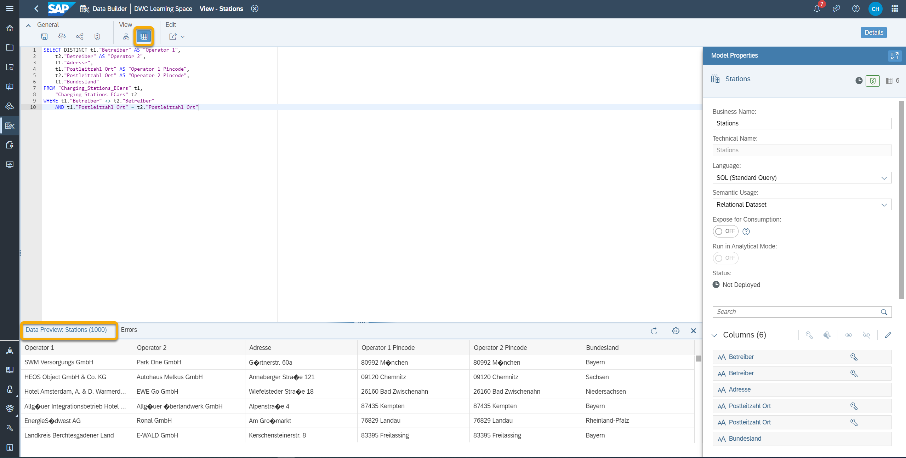
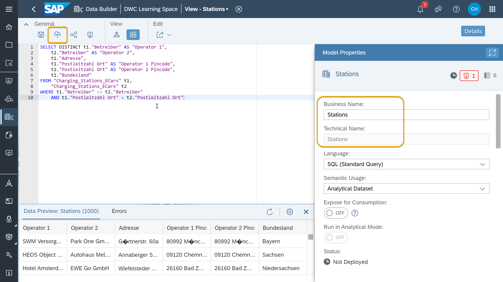

## Prerequisites
- You have your SAP Data Warehouse Cloud tenant or you have signed up for a [trial account] (https://www.sap.com/products/data-warehouse-cloud/trial.html)
- You have imported data into your Space.


## Details
### You will learn
- How to create a SQL view in your Space
- How to preview and deploy a SQL view
- How to use SAP HANA-based SQL script language in SAP Data Warehouse Cloud


SAP Data Warehouse Cloud is a flexible tool that allows you to model your data in whatever way you prefer: using graphical, drag-and-drop views, or using SQL statements. You can efficiently write SQL queries to manipulate data models and create SQL views in SAP Data Warehouse Cloud that will then feed business intelligence tools.
If you are unsure what data modeling means, or what a joins and unions are, please use our **community blog posts** to get familiar with these concepts:

• [Data Modeling in SAP Data Warehouse Cloud](https://blogs.sap.com/2021/07/20/data-modeling-in-sap-data-warehouse-cloud/)

• [Facts, Measures and Dimensions](https://blogs.sap.com/2021/07/22/facts-measures-and-dimensions/)


---

[ACCORDION-BEGIN [Step 1: ](Create a view using SQL)]

To start modeling your data using the graphical view in the Data Builder of SAP Data Warehouse Cloud, follow these steps:

1.	Go to the **Data Builder** in the menu of left-hand side of the SAP Data Warehouse Cloud welcome page and select the Space in which you want to model your data.

    !

2.	Then, click on **New SQL View**.

    !

3. You can see on the left side of the screen a list of your local and remote tables and views. In the center of the screen, you can see an area to input your SQL code. As you type your code, SAP Data Warehouse Cloud will offer suggestions.
> !
>
> Suggestions include SQL commands as well as table and column names found in your sources. This way, you can move faster and make sure you avoid typos on the way.

4. Below is an example of self-join in SQL code which fetches all the operators, address, postal code and state of electric charging stations in the same postal code. The table used as an example is `Charging_Stations_ECars`.

```SQL
SELECT DISTINCT t1."Betreiber" AS "Operator 1",
	t2."Betreiber" AS "Operator 2",
	t1."Adresse",
	t1."Postleitzahl Ort" AS "Operator 1 Pincode",
	t2."Postleitzahl Ort" AS "Operator 2 Pincode",
	t1."Bundesland"
FROM "Charging_Stations_ECars" t1,
	"Charging_Stations_ECars" t2
WHERE t1."Betreiber" <> t2."Betreiber"
	AND t1."Postleitzahl Ort" = t2."Postleitzahl Ort"

```
  !

> Exposing the SQL views makes the object available for consumption in SAP Analytics Cloud with which you can invoke business intelligence tools on your data and use them for data analysis. To do this you will have to define the data model type as a `Analytical Dataset` in the model properties sidebar of the view and toggle on the option **Expose for consumption**.

> !

You can also convert your **Graphical View** in the SQL statements. You can refer the step 4 of **[Preview and Transform Your Data in a Graphical View](data-warehouse-cloud-graphical2-datapreview)** for information on converting your graphical view to SQL statements.

You can also go through the below video which explains the same process of converting graphical view in to SQL statements.

<iframe width="560" height="315" src="https://www.youtube.com/embed/IRnt2_dDxzI" title="YouTube video player" frameborder="0" allow="accelerometer; autoplay; clipboard-write; encrypted-media; gyroscope; picture-in-picture" allowfullscreen></iframe>

[DONE]
[ACCORDION-END]

[ACCORDION-BEGIN [Step 2: ](Preview and deploy SQL view)]

1.	Once you have the SQL code finished, you can click on the shield icon next to the deploy icon to validate your code. You will see a confirmation on the bottom of the screen if your code is valid or not.

    !

2.	To preview the data, you can click on the view icon from the view dropdown menu at the top.

    !

3.	You can use the sidebar on the right to add business semantics to your data model, just as you would using the graphical view. When you are ready and your code is valid, just save and deploy your data model.

    

[DONE]
[ACCORDION-END]


[ACCORDION-BEGIN [Step 3: ](Use SAP HANA-based SQL script language)]

If you are unsure about the **SAP HANA based SQL Script**, please refer our [SAP HANA database implementation of SQL](https://help.sap.com/viewer/791c41982ee345a19c4ec4b774222c4f/16.0.4.1/en-US/feca57aaf7d5431e827e104506bc19c1.html).

If you are already familiar with the **SAP HANA-based SQL Script** language, you will be pleased to know that you can re-use your existing skills and knowledge when creating data models in the SAP Data Warehouse Cloud.

With the SQL Script, you can define data intensive logic: use `control structures`, `variables`, create `IF` and `FOR` loops. These are just a few possibilities to name.

> Note that the use of SQL Script is currently limited to read-only user defined table functions, therefore **Data Definition Language (DDL)** or **Data Manipulation Language (DML)** are not currently supported.

In the video below, you will see the use of SQL Script to create an ABC Analysis to understand which products contribute the most to the revenue.

<iframe width="560" height="315" src="https://www.youtube.com/embed/BQRaKJTXmUY" title="YouTube video player" frameborder="0" allow="accelerometer; autoplay; clipboard-write; encrypted-media; gyroscope; picture-in-picture" allowfullscreen></iframe>

> **Well done!**
>
> You have completed the tutorial on Model Data with a SQL View in SAP Data Warehouse Cloud!
> Now it is time to continue learning. Please check out the other [SAP Data Warehouse Cloud tutorials available here] (https://developers.sap.com/tutorial-navigator.html?tag=products:technology-platform/sap-data-warehouse-cloud), and do not forget to follow the [SAP Data Warehouse Cloud tag](https://blogs.sap.com/tags/73555000100800002141/) in the SAP Community to hear about the most up to date product news.


[VALIDATE_6]
[ACCORDION-END]

---
